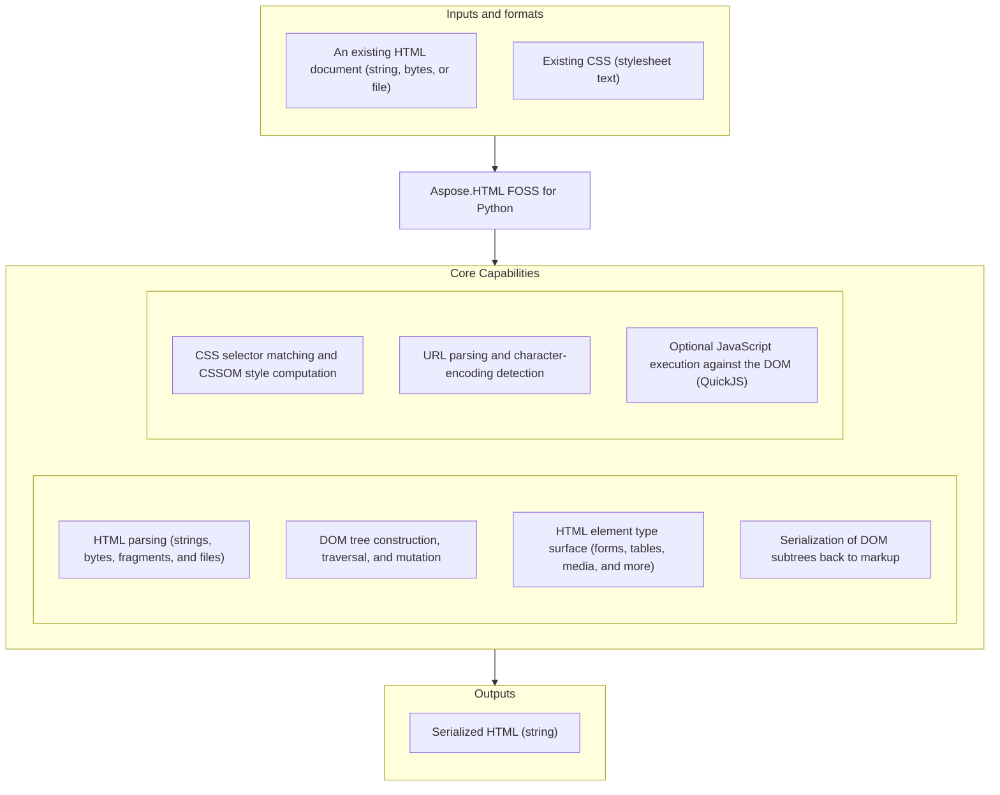

# Aspose.HTML FOSS for Python

[](LICENSE) [](https://github.com/aspose-html-foss/Aspose.HTML-FOSS-for-Python/graphs/contributors)

[](https://products.aspose.org/html/python/)

Aspose.HTML FOSS for Python is a free, open-source, MIT-licensed Python toolkit for parsing HTML into a standards-based DOM tree, applying CSS, and serializing markup back out. It provides WHATWG-style `HTMLDocument`/`Document`/`Element` APIs, CSS selector matching and CSSOM-based computed-style resolution, WHATWG `URL`/`URLSearchParams` handling, and byte-stream encoding detection, with an optional QuickJS-backed JavaScript execution bridge for running scripts against the parsed DOM.

## Navigation

- [At a Glance](#at-a-glance)
- [Key Capabilities](#key-capabilities)
- [Installation](#installation)
- [Dependencies](#dependencies)
- [Quick Start](#quick-start)
- [Additional Examples](#additional-examples)
- [API Reference](#api-reference)
- [Documentation & Resources](#documentation--resources)
- [Scope and Limitations](#scope-and-limitations)
- [Development and Testing](#development-and-testing)
- [License](#license)

## At a Glance



## Key Capabilities

- Parse HTML strings, bytes, fragments, and files into a DOM document with `HTMLDocument.parse()`, `HTMLDocument.parse_fragment()`, and `HTMLDocument.load()`; the lower-level `Tokenizer` and `TreeBuilder` classes implement the WHATWG tokenization and tree-construction algorithms directly, for callers who need that level of control.
- Build, inspect, and mutate DOM trees — create and update nodes programmatically with `Document.create_element()` and `append_child()`; read and write element attributes, classes, datasets, inline styles, and text content; and query documents by ID, tag name, class name, and selector-oriented helpers such as `get_element_by_id()`, `get_elements_by_tag_name()`, `TreeWalker`, `NodeIterator`, and `Range`.
- Work with a broad set of specialized HTML element classes — `HTMLFormElement`, `HTMLInputElement`, `HTMLSelectElement`, `HTMLTableElement`, `HTMLMediaElement`, and dozens more — each exposing the element-specific properties defined by its HTML interface.
- Serialize complete documents, fragments, and individual elements back to an HTML string with the `serialise()` function or `XMLSerializer`.
- Match CSS selectors and stylesheets against elements and resolve the cascade — specificity, inline-vs-author rules, `!important`, and inheritance — with `Element.get_computed_style()`; the CSSOM surface (`CSSStyleSheet`, `CSSStyleRule`, `CSSMediaRule`, and related rule types) models stylesheets structurally.
- Validate and manipulate URLs with `URL`, read and edit query strings with `URLSearchParams`, and detect byte-stream character encodings (BOM and content sniffing) with `detect_encoding()`.
- Execute JavaScript against a parsed DOM through `JSContext`, an optional QuickJS-backed bridge exposing `document.querySelector`, `window.getComputedStyle`, and similar read-only DOM proxies to script code; requires the `js` extra.

## Installation

A PyPI package has not been published yet. Install from a source checkout by putting the source
tree on `PYTHONPATH` directly — the same mechanism the repository's own test suite already relies
on (`pyproject.toml`'s `[tool.pytest.ini_options]` sets `pythonpath = ["src"]`):

```bash
git clone https://github.com/aspose-html-foss/Aspose.HTML-FOSS-for-Python.git
cd Aspose.HTML-FOSS-for-Python
pip install "skia-python>=87.0,<145"
```

Then add `src/` to `PYTHONPATH` (Linux/macOS: `export PYTHONPATH="$PWD/src:$PYTHONPATH"`;
Windows: `set PYTHONPATH=%cd%\src;%PYTHONPATH%`).

The distribution is named `aspose-html-foss`; the import package is `aspose_html`. The package
requires Python 3.10 or later; `skia-python` (used internally for text-layout metrics) is its one
real runtime dependency. JavaScript execution is optional — install `quickjs` directly to use it:

```bash
pip install "quickjs>=1.19,<2"
```

## Dependencies

### Required Package Dependencies

- `skia-python` >=87.0,<145 — used internally for text-layout metrics.

### Optional Dependencies

- `quickjs` >=1.19,<2 — enables the `JSContext` JavaScript execution bridge; gated behind the `js` extra, and the package builds and runs without it.

### Native and System Requirements

- Requires Python 3.10 or later.

### Development Dependencies

- `pytest` >=8 — runs the test suite.

## Quick Start

Parse HTML, update the DOM, and serialize the result:

```python
from aspose_html import HTMLDocument, serialise

document = HTMLDocument.parse("<main id='content'><h1>Hello</h1></main>")
content = document.get_element_by_id("content")

paragraph = document.create_element("p")
paragraph.text_content = "Updated through the DOM API."
content.append_child(paragraph)

print(serialise(content))
```

Attach a stylesheet and resolve the computed style — the ID selector wins over the class rule:

```python
from aspose_html.dom import Document
from aspose_html.cssom import CSSStyleSheet

document = Document()
element = document.create_element("div")
element.set_attribute("class", "foo")
element.set_attribute("id", "bar")
document.append_child(element)

sheet = CSSStyleSheet()
sheet.replace_sync(".foo { color: red } #bar { color: blue }")
document.attach_style_sheet(sheet)

style = element.get_computed_style()
print(style.get_property_value("color"))  # "blue"
```

## Additional Examples

Runnable scripts are available in the [`examples`](examples/) directory.

### Work With URLs and Search Parameters

```python
from aspose_html import URL

url = URL("https://example.com/articles?category=html")
url.search_params.set("page", "2")

print(str(url))
```

<details>
<summary>View Additional Examples</summary>

### Query Elements By Tag Name

```python
from aspose_html import HTMLDocument

document = HTMLDocument.parse("<article><h1>News</h1><p>Hello</p></article>")
heading = document.get_elements_by_tag_name("h1").item(0)

print(heading.text_content)
```

### Detect Character Encoding From Bytes

```python
from aspose_html.encoding.detection import detect_encoding

result = detect_encoding(b"\xef\xbb\xbf<p>x</p>")
print(result.encoding)
print(result.confidence)
print(result.text)
```

### Execute JavaScript Against The DOM

```python
from aspose_html.dom import Document
from aspose_html.js import JSContext

document = Document()
element = document.create_element("div")
document.append_child(element)

with JSContext(document) as ctx:
    result = ctx.evaluate("1 + 1")
    print(result)  # 2
```

### Drive The Tokenizer Directly

```python
from aspose_html.tokenizer import Tokenizer, TokenizerState

tokenizer = Tokenizer("<p>Hello</p>")
tokens = list(tokenizer.tokenize())
print(tokens[0].tag_name)  # "p"
```

</details>

## API Reference

The primary entry point is `HTMLDocument`, which parses HTML into a `Document` tree built from `Node`/`Element` and the specialized `HTMLElement` subclasses. The DOM tree can be queried and mutated directly, styled through the CSS/CSSOM surface, serialized back to markup, and optionally scripted through `JSContext`. The library exposes 243 public types in total, listed below by module, with curated highlights following.

<details>
<summary>View the Supported Public API Surface</summary>

### Core API

| Class | Description |
|---|---|
| `HTMLDocument` | Top-level entry point for parsing HTML into a Document tree. |

### CSS

| Class | Description |
|---|---|
| `AttributeSelector` | Matches elements by attribute presence or value. |
| `ClassSelector` | Matches elements whose class_list contains class_name: `.foo`. |
| `ComplexNotPseudoClass` | Matches elements that do NOT match any selector in the argument list. |
| `ComplexSelector` | A chain of CompoundSelectors joined by Combinators. |
| `CompoundSelector` | A sequence of simple selectors that all apply to the same element. |
| `HasPseudoClass` | Matches elements that have at least one relative match in their subtree. |
| `IsPseudoClass` | Matches elements that match any selector in a forgiving selector list. |
| `NthArgument` | Parsed An+B argument for :nth-child and related pseudo-classes. |
| `NthFilteredChildPseudoClass` | Matches elements at An+B position among siblings filtered by a selector. |
| `PseudoClassSelector` | A pseudo-class selector. |
| `SelectorList` | The root AST node. |
| `TypeSelector` | Matches elements by tag name: `div`. |
| `UniversalSelector` | Matches any element: `*`. |
| `WherePseudoClass` | Identical matching semantics to IsPseudoClass; always contributes 0 specificity. |

#### Enumerations

| Class | Description |
|---|---|
| `AttributeOperator` | Attribute selector operator types (CSS Selectors Level 3). |
| `Combinator` | Selector combinator types (CSS Selectors Level 3). |

### CSSOM

| Class | Description |
|---|---|
| `CSS` | Namespace class for CSS static utilities (CSS Conditional Rules §6). |
| `CSSCounterStyleRule` | A `@counter-style` rule (CSS Counter Styles Level 3 §3, CSSOM §5.4 type 11). |
| `CSSDeclarationBlock` | A small CSSStyleDeclaration-compatible declaration container. |
| `CSSFontFaceRule` | A `@font-face` rule holding font descriptor declarations (CSS Fonts §4.4). |
| `CSSImportRule` | An `@import` statement rule (CSSOM §6.7). |
| `CSSKeyframeRule` | A single keyframe descriptor within a `@keyframes` rule (CSSOM Animations §7). |
| `CSSKeyframesRule` | A `@keyframes` rule containing animation keyframe descriptors (CSSOM Animations §7). |
| `CSSLayerBlockRule` | A CSS `@layer` block rule assigning child rules to a named cascade layer. |
| `CSSLayerStatementRule` | A CSS `@layer` statement rule declaring cascade layer order. |
| `CSSMediaRule` | Media rule scaffold for nested style rules. |
| `CSSNamespaceRule` | A `@namespace` rule (CSSOM §6.6, type 10). |
| `CSSPageRule` | CSS `@page` rule (CSSOM §6.4). |
| `CSSPropertyRule` | CSS `@property` rule stub (CSS Properties and Values API §3). |
| `CSSRule` | Base class for CSSOM rules. |
| `CSSRuleList` | Ordered, live CSS rule collection. |
| `CSSStyleRule` | Style rule (`selector { declarations }`). |
| `CSSStyleSheet` | Minimal CSSOM stylesheet object (CSSOM §6.4). |
| `CSSSupportsRule` | A `@supports` rule with a condition and nested style rules (CSS Conditional Rules §2). |

### DOM

| Class | Description |
|---|---|
| `AbortController` | Controls cancellation of operations via an `AbortSignal`. |
| `AbortSignal` | Represents the signal half of an AbortController pair. |
| `AbstractRange` | Read-only boundary-point contract shared by range-family APIs. |
| `Attr` | An attribute attached to an Element. |
| `BarProp` | Represents a browser toolbar object (WHATWG HTML §7.7.3). |
| `BroadcastChannel` | Deterministic same-runtime BroadcastChannel fan-out delivery. |
| `BrowsingContext` | Internal owner of navigation lifecycle/document state. |
| `CDATASection` | A CDATA section node (extends Text per WHATWG DOM Standard). |
| `CSSStyleDeclaration` | A live view of an element's inline style attribute. |
| `CharacterData` | Abstract base for Text, Comment, CDATASection, and ProcessingInstruction. |
| `Comment` | An HTML comment node. |
| `ComputedStyleDeclaration` | Read-only resolved style declarations for an element. |
| `Console` | Headless console stub exposing `log`, `info`, `warn`, `error`, and `debug` methods (WHATWG Console Standard). |
| `Crypto` | Minimal stub for the Crypto interface (W3C Web Crypto API §10.1). |
| `CustomElementRegistry` | Registers and resolves custom element constructors via `define()`, `get()`, and `when_defined()`. |
| `CustomEvent` | An Event carrying an arbitrary detail payload. |
| `DOMConfiguration` | Baseline DOMConfiguration compatibility surface. |
| `DOMException` | Base for all DOM exceptions. |
| `DOMImplementation` | Legacy DOMImplementation compatibility surface. |
| `DOMParser` | Parse markup strings into DOM documents. |
| `DOMRect` | An axis-aligned bounding rectangle (CSSOM View §7.1). |
| `DOMRectList` | An immutable sequence of `DOMRect` objects (CSSOM View §7.2). |
| `DOMStringMap` | A live dict-like view of an element's `data-*` custom attributes. |
| `DOMTokenList` | A live, mutable set of space-separated tokens backed by an element attribute. |
| `DataCloneError` | Raised when a value cannot be serialized by the structured clone algorithm. |
| `Document` | The root of a DOM tree. |
| `DocumentFragment` | A lightweight container for a sub-tree. |
| `DocumentPosition` | Named constants for the bitmask returned by `Node.compare_document_position`. |
| `DocumentType` | A document type declaration node (`<!DOCTYPE html>`). |
| `Element` | An HTML or XML element node. |
| `ErrorEvent` | Script error event (WHATWG HTML §8.1.3.6). |
| `Event` | A DOM event object per WHATWG DOM §2.2. |
| `EventTarget` | Base class for objects that can receive DOM events. |
| `FocusEvent` | Focus transition event (WHATWG UI Events §5.4). |
| `FormData` | Snapshot collection of form control name/value pairs. |
| `HTMLAddressElement` | HTML `<address>` element. |
| `HTMLAnchorElement` | HTML `<a>` anchor element. |
| `HTMLAreaElement` | HTML `<area>` image-map hyperlink area. |
| `HTMLArticleElement` | HTML `<article>` element. |
| `HTMLAsideElement` | HTML `<aside>` element. |
| `HTMLAudioElement` | HTML `<audio>` element. |
| `HTMLBRElement` | HTML `<br>` line-break element (structural subclass). |
| `HTMLBaseElement` | HTML `<base>` element. |
| `HTMLBodyElement` | HTML `<body>` element (structural subclass). |
| `HTMLButtonElement` | HTML `<button>` element. |
| `HTMLCanvasElement` | HTML `<canvas>` element. |
| `HTMLCollection` | A live, ordered collection of Element-type children only. |
| `HTMLDListElement` | HTML `<dl>` definition list element. |
| `HTMLDataElement` | HTML `<data>` element. |
| `HTMLDataListElement` | HTML `<datalist>` element providing autocomplete suggestions. |
| `HTMLDetailsElement` | HTML `<details>` disclosure widget element. |
| `HTMLDialogElement` | HTML `<dialog>` modal/non-modal dialog element. |
| `HTMLDivElement` | HTML `<div>` block container element. |
| `HTMLElement` | Base class for all HTML-namespace element types. |
| `HTMLEmbedElement` | HTML `<embed>` element. |
| `HTMLFieldSetElement` | HTML `<fieldset>` element for grouping form controls. |
| `HTMLFigCaptionElement` | HTML `<figcaption>` element. |
| `HTMLFigureElement` | HTML `<figure>` element. |
| `HTMLFooterElement` | HTML `<footer>` element. |
| `HTMLFormElement` | HTML `<form>` element. |
| `HTMLHRElement` | HTML `<hr>` thematic-break element (structural subclass). |
| `HTMLHeadElement` | HTML `<head>` element (structural subclass). |
| `HTMLHeaderElement` | HTML `<header>` element. |
| `HTMLHeadingElement` | HTML heading element — covers `<h1>` through `<h6>`. |
| `HTMLHtmlElement` | HTML `<html>` document element (structural subclass). |
| `HTMLIFrameElement` | HTML `<iframe>` element. |
| `HTMLImageElement` | HTML `` image element. |
| `HTMLInputElement` | HTML `<input>` form control element. |
| `HTMLLIElement` | HTML `<li>` list item element. |
| `HTMLLabelElement` | HTML `<label>` element. |
| `HTMLLegendElement` | HTML `<legend>` element (WHATWG §4.10.4). |
| `HTMLLinkElement` | HTML `<link>` element. |
| `HTMLMainElement` | HTML `<main>` element. |
| `HTMLMapElement` | HTML `<map>` element. |
| `HTMLMarkElement` | HTML `<mark>` element. |
| `HTMLMediaElement` | Base class for HTML media elements (`<audio>` / `<video>`). |
| `HTMLMenuElement` | Represents an HTML `<menu>` element. |
| `HTMLMetaElement` | HTML `<meta>` element. |
| `HTMLMeterElement` | HTML `<meter>` element for displaying a scalar value in a range. |
| `HTMLModElement` | HTML `<ins>`/`<del>` modification element. |
| `HTMLNavElement` | HTML `<nav>` element. |
| `HTMLNoScriptElement` | HTML `<noscript>` element. |
| `HTMLOListElement` | HTML `<ol>` ordered list element. |
| `HTMLObjectElement` | HTML `<object>` element. |
| `HTMLOptGroupElement` | HTML `<optgroup>` element for grouping options in a select list. |
| `HTMLOptionElement` | HTML `<option>` element representing a choice in a select list. |
| `HTMLOptionsCollection` | Live collection of `<option>` elements for a `<select>`. |
| `HTMLOutputElement` | HTML `<output>` element for displaying calculation results. |
| `HTMLParagraphElement` | HTML `<p>` paragraph element. |
| `HTMLParamElement` | HTML `<param>` element. |
| `HTMLPictureElement` | HTML `<picture>` element (structural subclass). |
| `HTMLPreElement` | HTML `<pre>` preformatted text element (structural subclass). |
| `HTMLProgressElement` | HTML `<progress>` element showing task completion. |
| `HTMLQuoteElement` | HTML `<blockquote>`/`<q>` quote element. |
| `HTMLRubyElement` | HTML `<ruby>`/`<rt>`/`<rp>` element. |
| `HTMLScriptElement` | HTML `<script>` element. |
| `HTMLSectionElement` | HTML `<section>` element. |
| `HTMLSelectElement` | HTML `<select>` element. |
| `HTMLSmallElement` | HTML `<small>` element. |
| `HTMLSourceElement` | HTML `<source>` element. |
| `HTMLSpanElement` | HTML `<span>` inline container element. |
| `HTMLStyleElement` | HTML `<style>` element. |
| `HTMLSummaryElement` | Represents an HTML `<summary>` element. |
| `HTMLTableCaptionElement` | HTML `<caption>` element. |
| `HTMLTableCellElement` | HTML `<td>` or `<th>` element. |
| `HTMLTableColElement` | HTML `<col>` or `<colgroup>` element. |
| `HTMLTableElement` | HTML `<table>` element. |
| `HTMLTableRowElement` | HTML `<tr>` element. |
| `HTMLTableSectionElement` | HTML `<thead>`, `<tbody>`, or `<tfoot>` element. |
| `HTMLTemplateElement` | HTML `<template>` element holding inert content. |
| `HTMLTextAreaElement` | HTML `<textarea>` multi-line text input element. |
| `HTMLTimeElement` | HTML `<time>` element. |
| `HTMLTitleElement` | HTML `<title>` element. |
| `HTMLTrackElement` | HTML `<track>` element. |
| `HTMLUListElement` | HTML `<ul>` unordered list element. |
| `HTMLUnknownElement` | Represents an element with an unrecognized tag name; constructible directly, though the parser's tag-registry dispatch does not produce it automatically. |
| `HTMLVideoElement` | HTML `<video>` element. |
| `HTMLWBRElement` | HTML `<wbr>` element. |
| `HashChangeEvent` | Same-document fragment navigation event. |
| `HierarchyRequestError` | Raised when the tree hierarchy is violated. |
| `History` | In-memory session history for a Window. |
| `InUseAttributeError` | Raised when an Attr is already in use by another element. |
| `IndexSizeError` | Raised when an index or size is out of range. |
| `InputEvent` | Text-input event (WHATWG Input Events Level 2 / WHATWG UI Events §5.6). |
| `IntersectionObserver` | Headless IntersectionObserver API-shape stub. |
| `IntersectionObserverEntry` | Headless IntersectionObserver entry stub. |
| `InvalidCharacterError` | Raised when an invalid character is used. |
| `InvalidStateError` | Raised when an operation is performed in an invalid state. |
| `KeyboardEvent` | Keyboard event (WHATWG UI Events §5.3). |
| `Location` | Browsing-context location object exposing URL components (`href`, `protocol`, `host`, `pathname`) plus `assign()`/`replace()`/`reload()` navigation stubs. |
| `MediaQueryList` | MediaQueryList returned by `Window.match_media`. |
| `MessageChannel` | Pair of linked `MessagePort` endpoints. |
| `MessagePort` | Deterministic same-runtime MessagePort queue baseline. |
| `MouseEvent` | Mouse or pointer event (WHATWG UI Events §5.2). |
| `MutationObserver` | Observe DOM mutations on a target node. |
| `MutationRecord` | One DOM mutation notification record. |
| `NamedNodeMap` | An ordered map of Attr objects keyed by attribute name. |
| `Navigator` | Browser-environment stub exposing user-agent, platform, and feature-detection properties (`user_agent`, `platform`, `languages`, `hardware_concurrency`). |
| `NoModificationAllowedError` | Raised when a node cannot be modified in its current context. |
| `Node` | Abstract base class for all WHATWG DOM nodes. |
| `NodeFilter` | Constants for TreeWalker and NodeIterator filtering. |
| `NodeIterator` | Flat, stateful iteration over DOM nodes matching a filter. |
| `NodeList` | A live, ordered collection of Node objects. |
| `NodeType` | Integer constants for the `node_type` property of DOM nodes. |
| `NotFoundError` | Raised when a node is not found in the expected location. |
| `NotSupportedError` | Raised when an operation is not supported. |
| `ParseError` | A parse error recorded during tree construction. |
| `Performance` | Minimal stub for the Performance interface. |
| `PerformanceEntry` | A single performance timeline entry. |
| `PerformanceTiming` | Legacy Navigation Timing Level 1 interface stub. |
| `PopStateEvent` | History traversal event carrying the active entry state. |
| `ProcessingInstruction` | A processing instruction node (e.g. `<?xml version="1.0"?>`); `node_name` returns the target and `node_value`/`data` return the PI data. |
| `Range` | A contiguous portion of a document tree (WHATWG DOM §5). |
| `ResizeObserver` | Headless ResizeObserver API-shape stub. |
| `ResizeObserverEntry` | Headless ResizeObserver entry stub. |
| `Screen` | Browser screen geometry — all values are stubs (server-side context). |
| `SecurityError` | Raised when an operation is blocked for security reasons. |
| `Selection` | Document-scoped selection with single-range semantics. |
| `StaticRange` | Immutable boundary-point range initialized from an init object. |
| `Storage` | Key-value store implementing the WHATWG HTML §12 Storage interface. |
| `StyleSheetList` | Live ordered stylesheet collection. |
| `SubtleCrypto` | Stub for the SubtleCrypto interface (W3C Web Crypto API §10). |
| `SyntaxError` | Raised when a string does not match the expected pattern or grammar. |
| `Text` | A text node. |
| `TreeWalker` | Cursor-style DOM traversal bounded to a root subtree. |
| `UIEvent` | Base class for user-interface events (WHATWG UI Events §5.1). |
| `ValidityState` | Constraint-validation flags for a form control. |
| `VisualViewport` | CSSOM View §9 VisualViewport — all values are headless stubs. |
| `Window` | Per-document window object with EventTarget behavior. |
| `WindowEventLoop` | Internal task-source scheduler used by `Window`/`BrowsingContext`. |
| `WrongDocumentError` | Raised when a node belongs to a different document. |
| `XMLSerializer` | Serialise DOM nodes to strings. |

### Encoding

| Class | Description |
|---|---|
| `EncodingDetectionResult` | Result of encoding detection and decoding for an HTML byte stream. |
| `UnsupportedEncodingError` | Raised when the detected encoding has no Python codec. |

### JS

| Class | Description |
|---|---|
| `JSContext` | A JavaScript execution context backed by QuickJS, pre-wired to a DOM. |
| `JSEvaluationError` | Raised when a JavaScript expression throws an exception. |
| `ModuleLoadPolicy` | Constants governing how a JSContext resolves module specifiers. |
| `ModuleNotFoundError` | Raised when a module specifier has no registered source. |
| `ModuleRegistry` | Maps module specifiers to ES module source strings. |

### Layout

| Class | Description |
|---|---|
| `BlockFragment` | Geometry fragment for a block-level box. |
| `BoxNode` | Single box-tree node produced by `build_box_tree`. |
| `BoxRoot` | Root wrapper returned by `build_box_tree`. |
| `BreakHints` | CSS fragmentation break hints (`break_before`, `break_after`, `break_inside`, `widows`, `orphans`) consumed by the layout engine. |
| `ComputedStyle` | Immutable layout-facing snapshot of an element's resolved style. |
| `Display` | Resolved display triple per CSS Display L3 §2. |
| `EdgeSizes` | Logical edge sizes in CSS px units. |
| `FragmentRoot` | Root wrapper for block-layout fragment output. |
| `InlineTextFragment` | Positioned inline text fragment for a single shaped run. |
| `LineFragment` | Single inline formatting context line box. |
| `PageFragment` | Single paginated fragmentainer (page box) with ordered content. |
| `PageMarginBoxes` | Placeholder page-margin-box container for later paint stages. |
| `ShapedRun` | Shaped text-run payload with deterministic metrics. |

### Tokenizer

| Class | Description |
|---|---|
| `CharacterToken` | A character token carrying one or more Unicode characters. |
| `CommentToken` | A comment token, e.g. `<!-- text -->`. |
| `DoctypeToken` | A DOCTYPE token emitted by the WHATWG tokeniser. |
| `EndTagToken` | An end tag token, e.g. `</div>`. |
| `EofToken` | An end-of-file token. |
| `StartTagToken` | A start tag token, e.g. `<div class="x">`. |
| `Tokenizer` | WHATWG HTML tokeniser (§13.2.5). |

#### Enumerations

| Class | Description |
|---|---|
| `TokenizerState` | All tokeniser states defined in WHATWG HTML Living Standard §13.2.5. |

### Tree

| Class | Description |
|---|---|
| `ActiveFormattingList` | The list of active formatting elements as defined in §13.2.4.3. |
| `StackOfOpenElements` | The stack of open elements as defined in §13.2.4.2. |
| `TemplateInsertionModeStack` | The template insertion mode stack per §13.2.4.1. |
| `TreeBuilder` | Drives the WHATWG tree construction algorithm. |

#### Enumerations

| Class | Description |
|---|---|
| `InsertionMode` | The 23 WHATWG insertion modes (§13.2.6). |

### URL

| Class | Description |
|---|---|
| `URL` | WHATWG-style URL object with `parse()`/`can_parse()` and component properties (`href`, `protocol`, `host`, `search_params`). |
| `URLParseError` | Raised when a string cannot be parsed as a URL. |
| `URLSearchParams` | Ordered query-string pairs with duplicate-key support. |

---

#### Detailed Member Reference

### HTML Parsing and Documents

- `HTMLDocument` — `parse(html, *, encoding=None, base_url=None)`, `parse_fragment(html, context_element=None, *, encoding=None)`, `load(path)`.
- `parse_html(html, *, base_url=None) -> Document` / `TreeBuilder.run()` / `Tokenizer(text).tokenize()` — the lower-level parsing pipeline `HTMLDocument.parse()` is built on.

### DOM Core

- `Document` — the root of a DOM tree; `create_element(tag_name)`, `create_text_node(data)`, `append_child(node)`, `get_element_by_id(id)`, `get_elements_by_tag_name(name)`, `attach_style_sheet(sheet)`.
- `Element` — `get_attribute`/`set_attribute`/`remove_attribute`, `class_list` (`DOMTokenList`), `dataset` (`DOMStringMap`), `text_content`, `get_computed_style()`, `style` (`CSSStyleDeclaration`).
- `Node` — abstract base for all tree members; `NodeList`, `HTMLCollection` — live node collections; `Attr`, `NamedNodeMap` — attribute nodes and their map.
- `TreeWalker`, `NodeIterator`, `Range`, `StaticRange`, `Selection` — bounded traversal and range/selection APIs.
- `Event`, `CustomEvent`, `MouseEvent`, `KeyboardEvent`, `FocusEvent`, `InputEvent`, `EventTarget`, `MutationObserver` — the DOM event and mutation-observation surface.

### CSS And CSSOM

- `css.parse` — parse selector and declaration text; selector AST classes (`ClassSelector`, `TypeSelector`, `AttributeSelector`, `PseudoClassSelector`, `ComplexSelector`, `CompoundSelector`, and others) model the parsed grammar.
- `CSSStyleSheet`, `CSSStyleRule`, `CSSMediaRule`, `CSSFontFaceRule`, `CSSKeyframesRule`, and the other `CSSRule` subclasses — structural CSSOM stylesheet/rule objects.
- `CSSStyleDeclaration`, `ComputedStyleDeclaration` — live inline styles and read-only resolved (cascade-computed) styles.

### URL And Encoding

- `URL` — `parse(input, base)`, `can_parse(input, base)`; `href`, `protocol`, `host`, `pathname`, `search`, `search_params` (`URLSearchParams`).
- `URLSearchParams` — ordered query-string pairs with duplicate-key support.
- `detect_encoding(data, *, override_encoding=None) -> EncodingDetectionResult` — WHATWG-sequence BOM/meta-charset/UTF-8-default sniffing; `get_canonical_name(label)` normalizes an encoding label.

### JavaScript Bridge (Optional)

- `JSContext(document)` — a QuickJS-backed execution context pre-wired to a `Document`; `evaluate(js_source)`, `register_module(specifier, source)`, `eval_module(source)`. Requires the `js` extra.
- `ModuleRegistry`, `ModuleLoadPolicy` — maps module specifiers to ES module source and controls how `JSContext` resolves them.

</details>

## Documentation & Resources

- **[Getting started guide](https://docs.aspose.org/html/python/)** — installation, walkthroughs, and feature guides for this library.
- **[How-to guides & FAQ](https://kb.aspose.org/html/python/)** — task-focused answers for common HTML/DOM/CSS-processing questions.
- **[Full API reference](https://reference.aspose.org/html/python/)** — the complete, browsable reference for all 243 public types.
- **[Public API surface](PUBLIC_API.md)** — the stable top-level entry points this library's compatibility guarantees cover.
- **[Contributing guide](CONTRIBUTING.md)** — development setup, test commands, and contribution guidelines.
- **[Security policy](SECURITY.md)** — how to report a vulnerability.
- **[Changelog](CHANGELOG.md)** — notable changes to this package by version.
- Found a bug or have a feature request? [Open an issue](https://github.com/aspose-html-foss/Aspose.HTML-FOSS-for-Python/issues) on GitHub.

## Scope and Limitations

- CSS selector matching supports the core CSS Selectors Level 3 grammar, but several dynamic and legacy pseudo-classes are out of scope and raise `NotImplementedError` in the matcher and parser (`_matches_pseudo_class`, `_pseudo_not`), and single-colon legacy pseudo-element forms are not parsed.
- `CSSRule.type` and `CSSRule.css_text` (the CSSOM base-rule stubs) are not implemented; concrete rule subclasses such as `CSSStyleRule` and `CSSMediaRule` expose their own real properties instead.
- Form constraint validation (validity-state computation) and `HTMLImageElement.decode()` are present on the API surface but not yet implemented.
- The library builds internal layout structures (`BoxNode`, `FragmentRoot`, and related classes, using `skia-python` for text-run metrics) but does not yet expose a public API for rendering documents to an image or PDF.
- JavaScript execution (`JSContext`) requires the optional `quickjs` extra and exposes a read-only DOM proxy to script code; its dynamic `import()` bridge is not implemented, though static module registration via `ModuleRegistry` works.

These limitations don't apply to [Aspose.HTML for Python — Enterprise Edition](https://products.aspose.com/html/python-net/), which adds full CSS selector and pseudo-class coverage, constraint validation, image and PDF rendering, and unrestricted JavaScript execution.

## Development and Testing

The package needs no separate install step for testing — it uses the same source-checkout setup
as [Installation](#installation) above, with `pytest` already configured to run directly against
the local checkout. Install the test and runtime dependencies, then run the suite:

```bash
pip install "skia-python>=87.0,<145" "pytest>=8"
python -m pytest
```

Install `quickjs` to also exercise the JavaScript-bridge tests and doctests:

```bash
pip install "quickjs>=1.19,<2"
```

Without `quickjs` installed, `src/aspose_html/js/` is skipped automatically from doctest
collection and the tests under `tests/test_js/` skip via `pytest.importorskip("quickjs")`; the
Skia rendering-backend smoke test (`tests/test_render/test_skia_smoke.py`) is skipped the same way
when `skia-python` is unavailable.

Test coverage is organized by module: `test_html/`, `test_dom/`, `tokenizer/`, `test_tree/`, `test_css/`, `test_cssom/`, `test_layout/`, `test_url/`, `encoding/`, `test_js/`, `test_serialiser/`, `test_render/`, and `test_file_io.py`.

## License

This project is licensed under the [MIT License](LICENSE). The MIT License permits use, copying, modification, distribution, sublicensing, and commercial use, provided its copyright and permission notice are retained. The software is provided without warranty.
